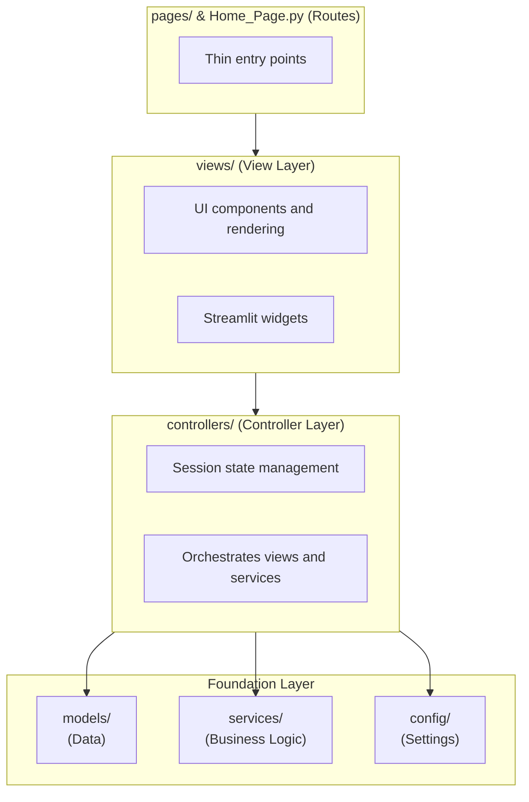

# CLAUDE.md

This file provides context for Claude Code to understand and work with this project.

## Project Overview

**Cooking Assistant** is a voice-controlled cooking application that guides users through recipes using natural conversation powered by Claude AI. Users can ask questions like "what's next?", "can I substitute X?", or "is this done yet?" while cooking.

## Architecture

This is a **Streamlit application** following the **MVC (Model-View-Controller)** pattern:



## Tech Stack

- **Frontend/Backend**: Python 3.12 / Streamlit
- **Database**: Azure SQL Server via SQLAlchemy
- **AI**: Claude API (Anthropic)
- **Voice Input**: speech_recognition (Google Speech Recognition - free)
- **Voice Output**: gTTS (Google Text-to-Speech)
- **Hosting**: Azure Container Apps
- **CI/CD**: GitHub Actions

## Project Structure

```
cooking-assistant/
├── Home_Page.py                  # Entry point (delegates to HomeView)
│
├── models/                       # Data layer - entities and repositories
│   ├── __init__.py               # Exports all models
│   ├── entities.py               # SQLAlchemy ORM models
│   └── repositories/             # Data access layer
│       └── shopping_list_repository.py
│
├── views/                        # View layer - UI presentation
│   ├── home_view.py              # Landing page
│   ├── cooking_view.py           # Cooking assistant UI
│   ├── planning_view.py          # Meal planning UI
│   ├── shopping_view.py          # Shopping list UI
│   └── components/               # Reusable UI components
│       ├── audio.py
│       ├── chat.py
│       ├── sidebar/
│       └── share/
│
├── controllers/                  # Controller layer - orchestration
│   ├── cooking_controller.py     # Cooking session logic
│   ├── planning_controller.py    # Meal planning logic
│   └── shopping_controller.py    # Shopping list logic
│
├── services/                     # Business logic layer
│   ├── claude_service.py         # Claude API interactions
│   ├── recipe_service.py         # Recipe data access
│   ├── audio_service.py          # Voice I/O
│   ├── shopping_list_service.py  # Ingredient aggregation
│   └── notification_service.py   # SMS/Email
│
├── config/                       # Configuration
│   ├── settings.py               # Pydantic settings
│   └── database.py               # SQLAlchemy connection
│
├── pages/                        # Streamlit routing (thin)
│   ├── 1_🍳_Cook.py
│   ├── 2_📋_Plan_Meals.py
│   └── 3_🛒_Shopping_List.py
│
├── infrastructure/
│   └── schema.sql                # Database DDL
├── .github/workflows/
│   └── deploy.yml                # CI/CD pipeline
├── requirements.txt
├── Dockerfile
└── .env.example
```

## Database Schema

| Table | Purpose |
|-------|---------|
| `Recipes` | Recipe metadata (name, description, times, servings) - **global/shared** |
| `Ingredients` | Normalized ingredient names - **global/shared** |
| `UnitsOfMeasure` | Normalized units - **global/shared** |
| `RecipeIngredients` | Links recipes to ingredients with quantities |
| `Steps` | Recipe preparation steps with order |
| `ShoppingLists` | User's shopping lists - **per-user** (has `UserId`) |
| `ShoppingListItems` | Items in a shopping list |
| `ShoppingListLinks` | Shareable links for shopping lists |

Key relationships:
- `Recipe` → has many `RecipeIngredients` → each links to `Ingredient` and optional `UnitOfMeasure`
- `Recipe` → has many `Steps` (ordered by `OrderIndex`)
- `ShoppingList` → belongs to a user (via `UserId`)
- Foreign keys use `ON DELETE CASCADE`

## Key Patterns

### Configuration
```python
from config.settings import get_settings
settings = get_settings()
```

Required env vars: `DB_SERVER`, `DB_NAME`, `DB_USER`, `DB_PASSWORD`, `ANTHROPIC_API_KEY`

### Database Access
```python
from config.database import SessionLocal
from models import Recipe

db = SessionLocal()
recipes = db.query(Recipe).all()
db.close()
```

### MVC Pattern
```python
# pages/*.py - Thin routing layer
from views.cooking_view import CookingView
view = CookingView()
view.render()

# views/*.py - UI presentation, delegates to controller
class CookingView:
    def __init__(self):
        self.controller = CookingController()
    def render(self):
        # Streamlit UI code

# controllers/*.py - Orchestration and state
class CookingController:
    def __init__(self):
        self.claude = ClaudeService()
    def send_message(self, msg):
        # Business logic
```

### Streamlit Session State
```python
if "messages" not in st.session_state:
    st.session_state.messages = []
```

### Authentication (Azure Entra ID)
```python
from config.auth import get_current_user, require_auth

# Optional auth check
user = get_current_user()
if user:
    print(f"Logged in as {user.name}")

# Required auth (stops page if not logged in)
user = require_auth()
print(f"User ID: {user.user_id}")
```

For local development, set environment variables to simulate a user:
```bash
export DEV_USER_ID='test-user-123'
export DEV_USER_NAME='Test User'
export DEV_USER_EMAIL='test@example.com'
```

## Development Commands

```bash
# Install dependencies
pip install -r requirements.txt

# Run locally
streamlit run Home_Page.py

# Run with Docker
docker build -t cooking-assistant .
docker run -p 80:80 --env-file .env cooking-assistant
```

## Application Flow

1. **Recipe Selection**: User picks a recipe from the database
2. **Prep Phase**: Claude guides through gathering ingredients
3. **Cooking Phase**: Step-by-step guidance with voice I/O
4. **Conversation**: User can ask questions anytime ("what's next?", "can I substitute?")

## Code Conventions

- **Type hints**: All functions should have type hints
- **Streamlit caching**: Use `@st.cache_data` for database queries
- **Session state**: Store conversation history in `st.session_state`

## Current Status

- [x] Database schema designed
- [x] Streamlit app with voice I/O
- [x] Claude integration for cooking guidance
- [x] Docker deployment to Azure
- [x] GitHub Actions CI/CD
- [x] Multi-user data isolation with Azure Entra ID

## Multi-User Support

Shopping lists are now isolated per user:
- Each `ShoppingList` has a `UserId` column (Entra ID object ID)
- Users only see their own shopping lists
- Shared links still work for unauthenticated access to specific lists
- Recipes remain globally shared

### Setup Authentication (Production)

Run the setup script to enable Easy Auth on your Container App:

```bash
# Make executable
chmod +x infrastructure/setup-easy-auth.sh

# Run it
./infrastructure/setup-easy-auth.sh <resource-group> <container-app-name>

# Example:
./infrastructure/setup-easy-auth.sh rg-cooking-assistant-dev ca-dev-cooking-assistant
```

This will:
1. Create an Entra ID App Registration
2. Configure Easy Auth on your Container App
3. Require users to sign in with Microsoft accounts

### Setup Authentication (Local Development)

When running locally, there's no Azure Easy Auth. Simulate a user with env vars:

```bash
# Get your Entra ID Object ID (if you have Azure CLI)
az ad signed-in-user show --query id -o tsv

# Set environment variables before running
export DEV_USER_ID='xxxxxxxx-xxxx-xxxx-xxxx-xxxxxxxxxxxx'
export DEV_USER_NAME='Your Name'
export DEV_USER_EMAIL='you@example.com'

# Then run the app
streamlit run Home_Page.py
```

### Database Migration

Run on existing databases to add the `UserId` column:
```bash
sqlcmd -S your-server.database.windows.net -d cookingdb -U admin -P 'password' \
  -i infrastructure/migrations/001_add_userid_to_shopping_lists.sql
```

## Future Work

1. **Recipe parsing**: Add recipes from URLs
2. **Session persistence**: Redis for multi-instance deployments
3. **Mobile app**: React Native app using a REST API (would require adding FastAPI back)
