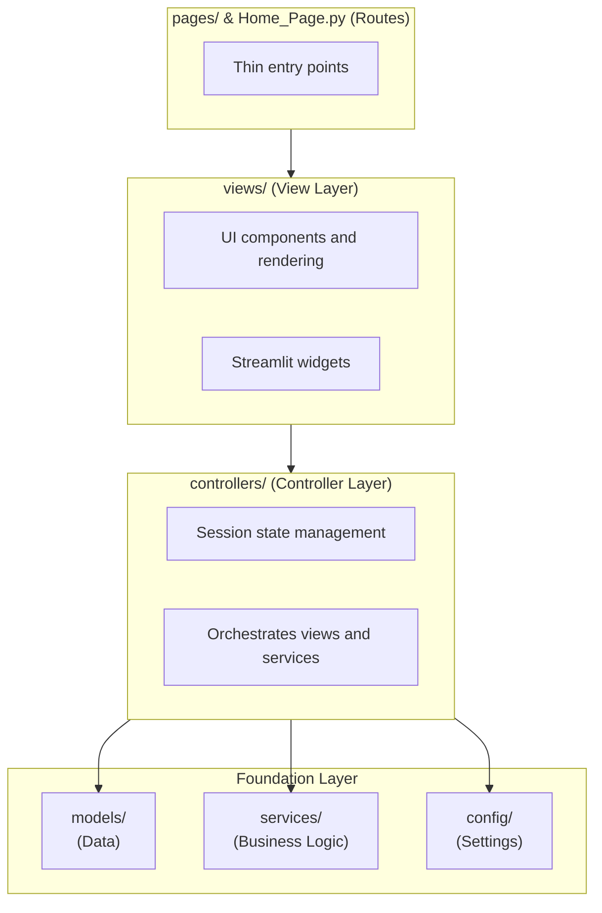
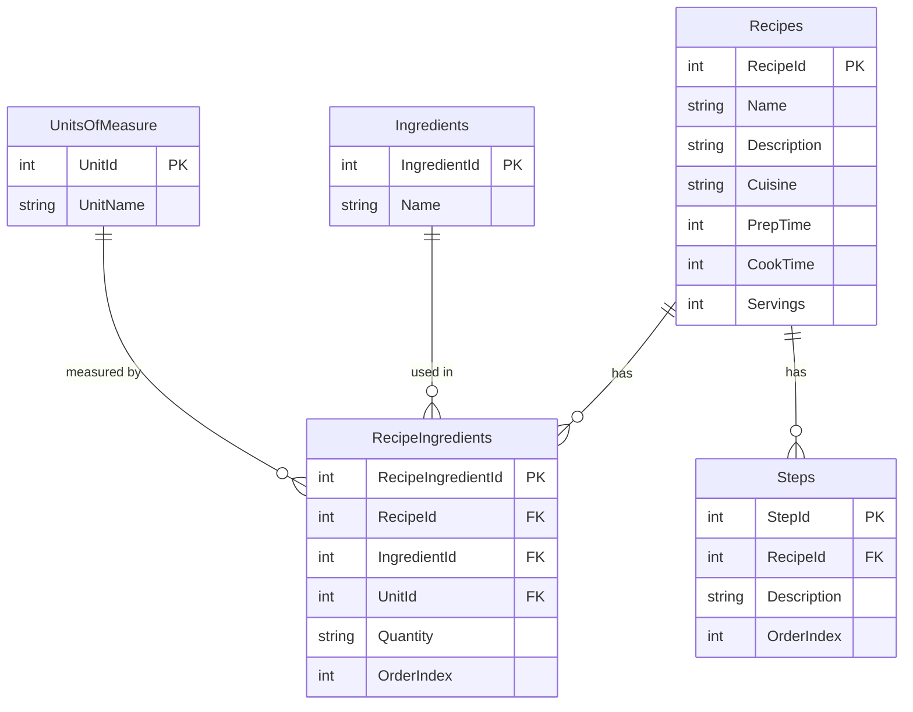

# Cooking Assistant

A voice-controlled cooking assistant that guides you through recipes using natural conversation powered by Claude AI.

## What It Does

Cooking Assistant provides an AI-powered sous chef that:

- **Guides you step-by-step** through any recipe with natural conversation
- **Answers questions** like "Can I substitute butter for oil?" or "Is this done yet?"
- **Supports voice input and output** for hands-free cooking
- **Remembers context** throughout your cooking session

### The Problem

Cooking with a recipe on your phone is frustrating—you can't scroll with wet hands, you lose your place, and you can't ask questions.

### The Solution

A conversational AI that knows your recipe and can read steps aloud, answer questions, suggest substitutions, and keep track of where you are.

## Tech Stack

| Component | Technology | Why |
|-----------|------------|-----|
| **Framework** | Streamlit | Fast prototyping, built-in UI components, session state |
| **Database** | Azure SQL Server + SQLAlchemy | Managed service, ORM for type safety |
| **AI** | Claude API (Anthropic) | Best-in-class conversation |
| **Voice Input** | SpeechRecognition (Google) | Free, no API key needed |
| **Voice Output** | gTTS (Google Text-to-Speech) | Free, British accent for friendly guidance |
| **Notifications** | Azure Communication Services | SMS delivery for shopping lists |
| **Grocery APIs** | Kroger API | Price comparison and product matching |
| **Hosting** | Azure Container Apps | Scales to zero, Docker-based |
| **Auth** | Azure Easy Auth (Entra ID) | Managed authentication layer |
| **IaC** | Azure Bicep | Reproducible, modular infrastructure |

## Project Structure

The application follows an **MVC (Model-View-Controller)** architecture:

```
cooking-assistant/
├── Home_Page.py                  # Entry point (delegates to HomeView)
│
├── pages/                        # Streamlit multi-page routing (thin)
│   ├── 1_🍳_Cook.py
│   ├── 2_📋_Plan_Meals.py
│   └── 3_🛒_Shopping_List.py
│
├── views/                        # View layer - UI presentation
│   ├── home_view.py
│   ├── cooking_view.py
│   ├── planning_view.py
│   ├── shopping_view.py
│   └── components/               # Reusable UI components
│       ├── audio.py
│       ├── chat.py
│       ├── sidebar/
│       └── share/
│
├── controllers/                  # Controller layer - orchestration
│   ├── cooking_controller.py
│   ├── planning_controller.py
│   └── shopping_controller.py
│
├── services/                     # Business logic layer
│   ├── claude_service.py         # Claude API interactions
│   ├── recipe_service.py         # Recipe data access
│   ├── audio_service.py          # Voice I/O
│   ├── shopping_list_service.py  # Ingredient aggregation
│   ├── notification_service.py   # SMS/Email via Azure
│   └── grocery_apis/             # Price comparison integrations
│       ├── base.py
│       └── kroger.py
│
├── models/                       # Data layer - entities and repositories
│   ├── entities.py               # SQLAlchemy ORM models
│   └── repositories/
│       └── shopping_list_repository.py
│
├── config/                       # Configuration
│   ├── settings.py               # Pydantic settings
│   ├── database.py               # SQLAlchemy connection
│   └── auth.py                   # Azure Entra ID authentication
│
├── infrastructure/
│   ├── schema.sql                # Database DDL
│   └── bicep/                    # Infrastructure as Code (Azure)
│       ├── main.bicep
│       ├── modules/
│       └── parameters/
├── .github/workflows/
│   └── deploy.yml                # CI/CD pipeline
├── requirements.txt
├── Dockerfile
└── .env.example
```

## Application Flow



**Cooking Phases:**
1. **Recipe Selection** — User picks a recipe from the database
2. **Prep Phase** — Claude helps gather and prepare ingredients
3. **Cooking Phase** — Step-by-step guidance triggered by "ready" or "let's start"
4. **Conversation** — User asks questions anytime via voice or text

## Database Schema



- **Normalized** — Ingredients and units stored once, referenced by many recipes
- **Ordered** — Steps and ingredients maintain order with `OrderIndex`
- **Cascade deletes** — Removing a recipe removes its ingredients and steps
- **Flexible quantities** — String type handles "1/2", "2-3", "a pinch"

## Local Development

### Prerequisites
- Python 3.12+
- Azure SQL database (or local SQL Server)
- Anthropic API key

### Setup

```bash
# Clone the repo
git clone https://github.com/corybeyer/cooking-assistant.git
cd cooking-assistant

# Create virtual environment
python -m venv venv
source venv/bin/activate  # Windows: venv\Scripts\activate

# Install dependencies
pip install -r requirements.txt

# Configure environment
cp .env.example .env
# Edit .env with your credentials

# Run the app
streamlit run Home_Page.py
```

Open http://localhost:8501 in your browser.

### Required Environment Variables

| Variable | Description |
|----------|-------------|
| `DB_SERVER` | Azure SQL server hostname |
| `DB_NAME` | Database name |
| `DB_USER` | Database username |
| `DB_PASSWORD` | Database password |
| `ANTHROPIC_API_KEY` | Claude API key |

## Docker

```bash
# Build
docker build -t cooking-assistant .

# Run
docker run -p 80:80 --env-file .env cooking-assistant
```

## Azure Deployment

### Option 1: Infrastructure as Code (Recommended)

Deploy the complete infrastructure using Azure Bicep:

```bash
# Create resource group
az group create --name rg-cooking-assistant-dev --location eastus

# Deploy all resources
az deployment group create \
  --resource-group rg-cooking-assistant-dev \
  --template-file infrastructure/bicep/main.bicep \
  --parameters infrastructure/bicep/parameters/dev.bicepparam \
  --parameters sqlAdminPassword='<password>' \
  --parameters anthropicApiKey='<api-key>'
```

This creates: Container Registry, SQL Server + Database, Key Vault, Container Apps Environment, Container App with Managed Identity, and Log Analytics.

See [infrastructure/bicep/README.md](infrastructure/bicep/README.md) for full documentation.

### Option 2: Manual Deployment

```bash
# Build in Azure Container Registry
az acr build \
  --registry acrcookingassistant \
  --image cooking-assistant:latest \
  https://github.com/corybeyer/cooking-assistant.git

# Update Container App
az containerapp update \
  --name ca-cooking-assistant \
  --resource-group rg-cooking-assistant \
  --image acrcookingassistant.azurecr.io/cooking-assistant:latest
```

## Security Features

- **Authentication** — Azure Container Apps Easy Auth (Entra ID)
- **Rate Limiting** — 30 requests per 60 seconds to prevent API abuse
- **Error Handling** — Server-side logging only, errors not exposed to users
- **Temp File Cleanup** — Audio files cleaned up to prevent disk exhaustion

## Project Status

- [x] Database schema design
- [x] Streamlit app with voice I/O
- [x] Claude AI integration
- [x] Docker deployment to Azure
- [x] GitHub Actions CI/CD
- [x] Rate limiting and auth
- [x] Infrastructure as Code (Bicep)
- [x] MVC architecture refactor
- [x] Meal planning with Claude conversation
- [x] Shopping list generation with ingredient aggregation
- [x] SMS delivery via Azure Communication Services
- [x] Shareable shopping list links
- [x] Multi-user support with Azure Entra ID
- [x] Kroger API integration for price comparison
- [ ] Recipe parsing from URLs
- [ ] Additional grocery store integrations (Walmart, Instacart)

## License

MIT License - see LICENSE file for details.
